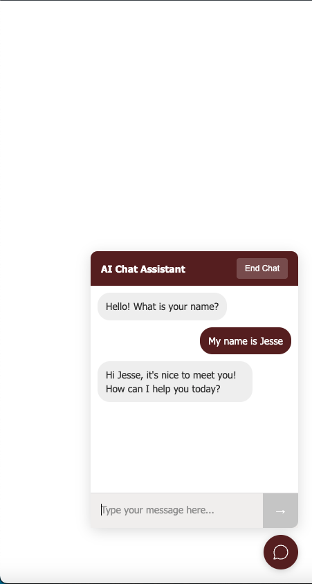

# AI-Powered Chatbot

A modern, responsive chatbot interface built with vanilla HTML, CSS, and JavaScript. This chatbot supports persistent conversations and can be easily embedded into any website.

## 🔗 Related Repositories

- **Frontend (this repo)**: Complete chatbot UI interface
- **Backend**: [AI Chatbot Server](https://github.com/yourusername/ai-chatbot-server) - API server with AI integration

## Features

- 🎨 **Modern UI Design** - Clean, responsive interface with smooth animations
- 💬 **Persistent Conversations** - Maintains chat history using localStorage
- 🔄 **Context Management** - Tracks user sessions and conversation flow
- 📱 **Mobile Responsive** - Works seamlessly on desktop and mobile devices
- 🚀 **Easy Integration** - Simple to embed into existing websites
- 🔧 **Customizable** - Easy to modify styling and behavior

## Demo



## Getting Started

### Prerequisites

- A modern web browser
- Backend server (see [AI Chatbot Server](https://github.com/yourusername/ai-chatbot-server))

### Quick Start (Full-Stack)

1. **Clone both repositories**:
```bash
# Frontend
git clone https://github.com/yourusername/ai-chatbot.git
cd ai-chatbot

# Backend (in a separate terminal)
git clone https://github.com/yourusername/ai-chatbot-server.git
cd ai-chatbot-server
npm install && npm start
```

2. **Start the frontend**:
```bash
# In the frontend directory
npm install
npm start
```

3. Visit `http://localhost:8000` to see the chatbot with full functionality.

### Frontend Only

To run just the frontend interface:

1. Clone this repository:
```bash
git clone https://github.com/yourusername/ai-chatbot.git
cd ai-chatbot
```

2. Open `chatbot.html` in your web browser or serve it using a local server:

2. Open `chatbot.html` in your web browser or serve it using a local server:
```bash
# Using Python
python -m http.server 8000

# Using Node.js
npx serve .
```

3. Visit `http://localhost:8000` to see the chatbot in action.

## Configuration

### API Integration

The chatbot is configured to work with a backend API. Update the `API_BASE_URL` in the script section:

```javascript
const API_BASE_URL = 'your-api-endpoint';
```

### Customization

#### Styling
Modify the CSS variables in the `<style>` section to match your brand:

```css
:root {
  --primary-color: #5c2121;
  --secondary-color: #f2f0ef;
  --text-color: #333;
}
```

#### Messages
Customize the initial greeting message:

```javascript
const messageData = {
  content: "Hello! How can I help you today?",
  type: "Bot"
};
```

## File Structure

```
ai-chatbot/
├── chatbot.html          # Main chatbot file
├── README.md            # Documentation
├── assets/
│   ├── icons/           # Chat icons
│   └── demo/            # Demo images
└── package.json         # Project metadata
```

## API Endpoints

The chatbot expects the following API endpoints:

### Start Conversation
```
POST /api/conversations/start-conversation
Content-Type: application/json

{
  "name": "User Name"
}
```

### Send Message
```
POST /api/conversations/send-message
Content-Type: application/json

{
  "userId": "user-id",
  "conversationId": "conversation-id",
  "message": {
    "content": "Hello",
    "type": "User"
  }
}
```

## Browser Support

- Chrome 60+
- Firefox 55+
- Safari 12+
- Edge 79+

## Contributing

1. Fork the repository
2. Create your feature branch (`git checkout -b feature/amazing-feature`)
3. Commit your changes (`git commit -m 'Add some amazing feature'`)
4. Push to the branch (`git push origin feature/amazing-feature`)
5. Open a Pull Request

## License

This project is licensed under the MIT License - see the [LICENSE](LICENSE) file for details.

## Acknowledgments

- Icons provided by [SVG Repo](https://svgrepo.com)
- Inspired by modern chat interfaces
- Built with accessibility in mind

## Support

If you have any questions or need help, please [open an issue](https://github.com/yourusername/ai-chatbot/issues) on GitHub.
